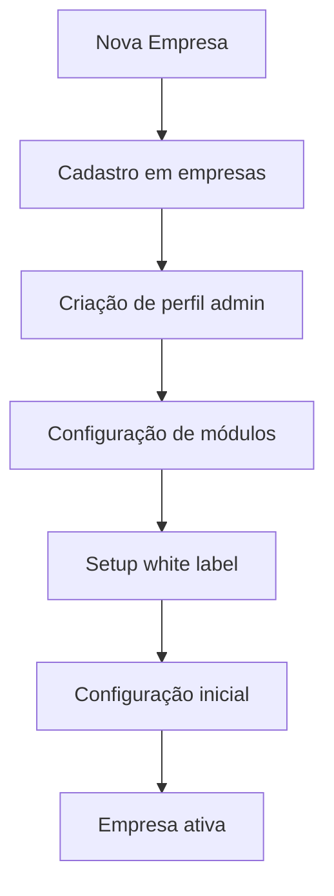
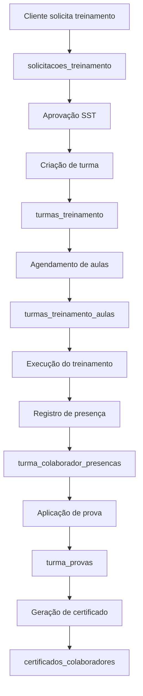
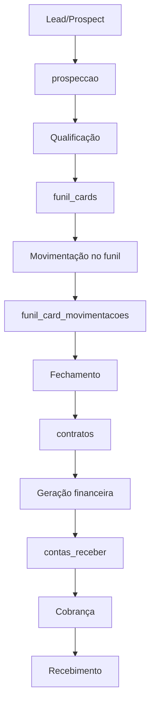
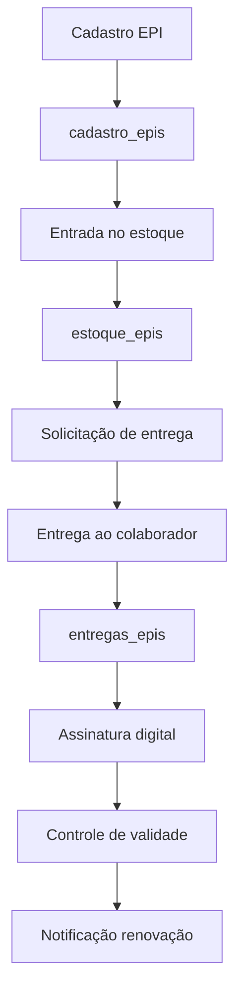
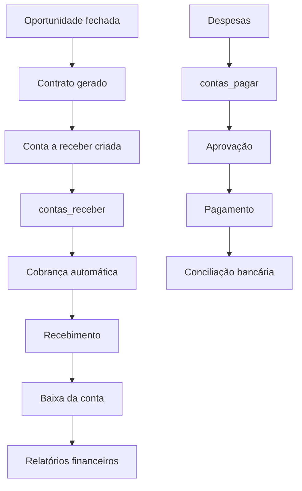

# Fluxos de Dados e Integrações - Sistema TORIQ

## Fluxos Principais de Negócio

### 1. Fluxo de Onboarding de Empresa



**Tabelas envolvidas:**
- `empresas` → `profiles` → `empresa_modulos` → `white_label_config`

### 2. Fluxo de Gestão de Treinamentos



**Integrações:**
- Storage para certificados PDF
- Sistema de assinatura digital
- Notificações automáticas

### 3. Fluxo Comercial (Toriq Corp)



**Automações:**
- Criação automática de contas a receber
- Notificações de follow-up
- Relatórios de conversão

### 4. Fluxo de Gestão de EPIs



**Validações:**
- Controle de CA (Certificado de Aprovação)
- Validade dos EPIs
- Rastreabilidade completa

### 5. Fluxo Financeiro Integrado



## Integrações Externas

### 1. APIs Governamentais

#### Receita Federal (CNPJ)
```typescript
// Edge Function: cnpj-lookup
interface CNPJResponse {
  cnpj: string;
  razao_social: string;
  nome_fantasia: string;
  endereco: EnderecoCompleto;
  atividade_principal: CNAE;
}
```

#### IBGE (Localização)
```typescript
// lib/ibgeService.ts
interface Estado {
  id: number;
  sigla: string;
  nome: string;
}

interface Cidade {
  id: number;
  nome: string;
  estado_id: number;
}
```

#### CBO (Classificação de Ocupações)
```typescript
// lib/cboService.ts
interface CBOOcupacao {
  codigo: string;
  titulo: string;
  descricao?: string;
}
```

### 2. Serviços de Terceiros

#### Google Maps (Distâncias)
```typescript
// lib/googleMapsService.ts
interface DistanceResult {
  distance: string;
  duration: string;
  status: string;
}
```

#### Sistema de Pagamentos
- PIX automático
- Boletos bancários
- Cartão de crédito

### 3. Notificações e Comunicação

#### Email Templates
- `invite-user.html` - Convite de usuários
- `reset-password.html` - Reset de senha
- `email-change.html` - Alteração de email

#### Push Notifications
```sql
-- Tabela de notificações
CREATE TABLE notificacoes (
  id UUID PRIMARY KEY,
  usuario_id UUID REFERENCES profiles(id),
  titulo VARCHAR(255),
  mensagem TEXT,
  tipo VARCHAR(50),
  lida BOOLEAN DEFAULT false,
  data_envio TIMESTAMPTZ DEFAULT NOW()
);
```

## Automações e Triggers

### 1. Triggers de Auditoria

```sql
-- Trigger universal de auditoria
CREATE OR REPLACE FUNCTION audit_trigger_function()
RETURNS TRIGGER AS $
BEGIN
  INSERT INTO audit_log (
    table_name,
    operation,
    old_data,
    new_data,
    user_id,
    timestamp
  ) VALUES (
    TG_TABLE_NAME,
    TG_OP,
    CASE WHEN TG_OP = 'DELETE' THEN row_to_json(OLD) ELSE NULL END,
    CASE WHEN TG_OP IN ('INSERT', 'UPDATE') THEN row_to_json(NEW) ELSE NULL END,
    auth.uid(),
    NOW()
  );
  RETURN COALESCE(NEW, OLD);
END;
$ LANGUAGE plpgsql;
```

### 2. Notificações Automáticas

```sql
-- Trigger para notificações
CREATE OR REPLACE FUNCTION send_notification_trigger()
RETURNS TRIGGER AS $
BEGIN
  -- Lógica para envio de notificações baseada na operação
  PERFORM send_notification(
    NEW.empresa_id,
    'Novo registro criado',
    'Um novo ' || TG_TABLE_NAME || ' foi criado'
  );
  RETURN NEW;
END;
$ LANGUAGE plpgsql;
```

### 3. Validações de Negócio

```sql
-- Validação de datas de treinamento
CREATE OR REPLACE FUNCTION validate_training_dates()
RETURNS TRIGGER AS $
BEGIN
  -- Verificar se instrutor está disponível
  -- Verificar capacidade da turma
  -- Validar pré-requisitos
  RETURN NEW;
END;
$ LANGUAGE plpgsql;
```

## Cron Jobs e Tarefas Automáticas

### 1. Geração de Contas Recorrentes

```sql
-- Edge Function: gerar-contas-recorrentes
-- Executa diariamente para criar contas mensais
SELECT cron.schedule(
  'gerar-contas-recorrentes',
  '0 6 * * *', -- Todo dia às 6h
  'SELECT gerar_contas_recorrentes();'
);
```

### 2. Notificações de Vencimento

```sql
-- Notificar vencimentos de documentos
SELECT cron.schedule(
  'notificar-vencimentos',
  '0 8 * * *', -- Todo dia às 8h
  'SELECT notificar_vencimentos_documentos();'
);
```

### 3. Limpeza de Dados

```sql
-- Limpeza de logs antigos
SELECT cron.schedule(
  'cleanup-logs',
  '0 2 * * 0', -- Domingo às 2h
  'DELETE FROM audit_log WHERE created_at < NOW() - INTERVAL ''90 days'';'
);
```

## Métricas e Analytics

### 1. Métricas de Negócio

```sql
-- View para dashboard executivo
CREATE VIEW dashboard_metricas AS
SELECT 
  e.nome as empresa,
  COUNT(DISTINCT c.id) as total_colaboradores,
  COUNT(DISTINCT tt.id) as treinamentos_mes,
  SUM(cr.valor) as receita_mes,
  AVG(fc.valor) as ticket_medio
FROM empresas e
LEFT JOIN colaboradores c ON c.empresa_id = e.id
LEFT JOIN turmas_treinamento tt ON tt.empresa_id = e.id 
  AND tt.created_at >= date_trunc('month', CURRENT_DATE)
LEFT JOIN contas_receber cr ON cr.empresa_id = e.id
  AND cr.data_recebimento >= date_trunc('month', CURRENT_DATE)
LEFT JOIN funil_cards fc ON fc.cliente_id = e.id
GROUP BY e.id, e.nome;
```

### 2. Métricas de Performance

```sql
-- Monitoramento de queries lentas
SELECT 
  query,
  calls,
  total_time,
  mean_time,
  rows
FROM pg_stat_statements
WHERE mean_time > 100
ORDER BY mean_time DESC;
```

## Backup e Recuperação

### 1. Estratégia de Backup

```sql
-- Backup incremental diário
pg_dump --format=custom --compress=9 --file=backup_$(date +%Y%m%d).dump toriq_db

-- Backup de tabelas críticas
pg_dump --table=empresas --table=profiles --table=contratos toriq_db > critical_backup.sql
```

### 2. Replicação

```sql
-- Configuração de réplica de leitura
-- Para relatórios e analytics sem impacto na produção
CREATE SUBSCRIPTION analytics_replica 
CONNECTION 'host=replica-server dbname=toriq_analytics' 
PUBLICATION analytics_pub;
```

## Monitoramento e Alertas

### 1. Alertas de Sistema

- **Conexões**: > 80% do limite
- **Espaço em disco**: > 85% usado
- **Queries lentas**: > 5 segundos
- **Falhas de RLS**: Tentativas de acesso não autorizado

### 2. Alertas de Negócio

- **Treinamentos vencidos**: Sem certificação há > 30 dias
- **Contas em atraso**: > 15 dias de vencimento
- **EPIs vencidos**: Próximo ao vencimento
- **Documentos de frota**: Vencimento em 30 dias

Este mapeamento de fluxos de dados fornece uma visão completa de como as informações transitam pelo sistema TORIQ, facilitando manutenção, debugging e evolução da plataforma.